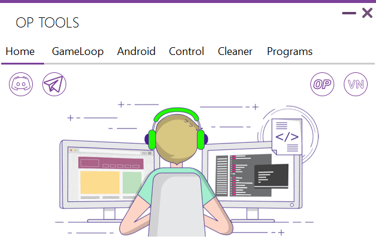
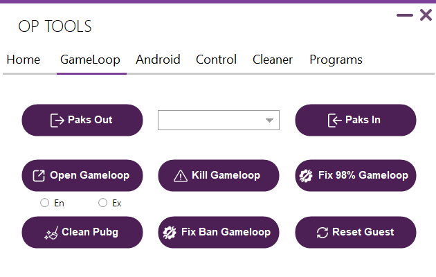
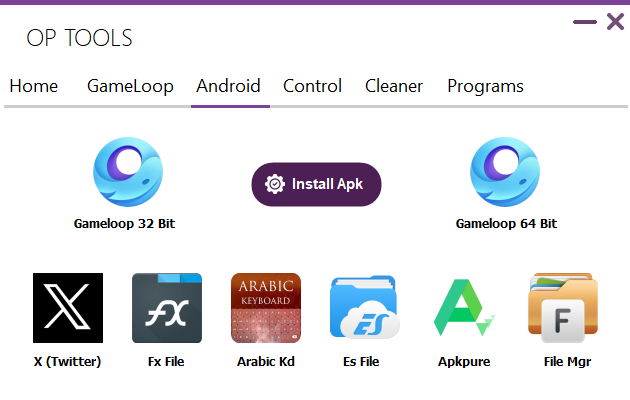
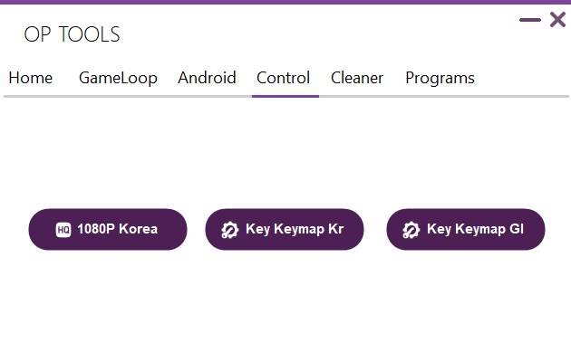
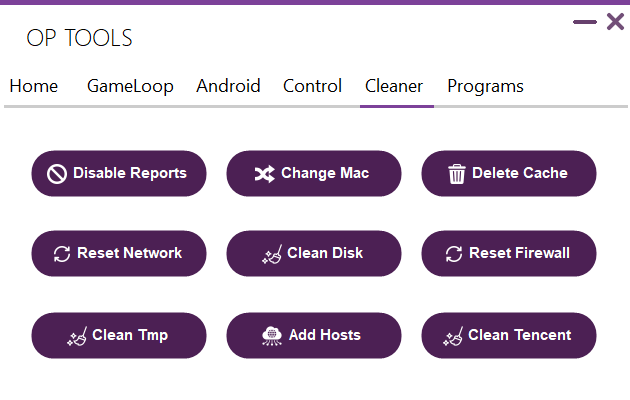
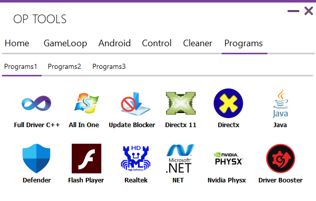
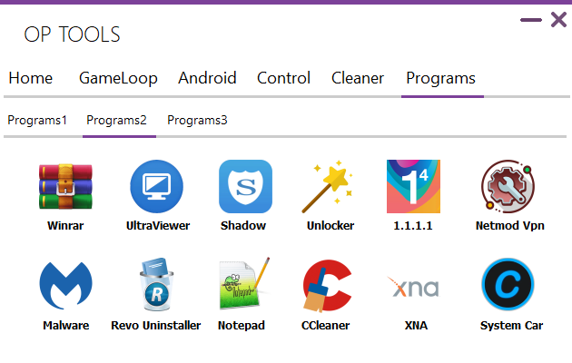
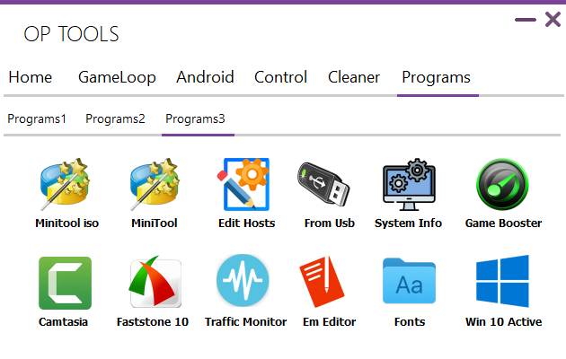

# Op Tools Source Code

**OP TOOLS** is a C# application developed by **FARHAT** with MetroFramework to provide a collection of tools for managing applications, performing repairs, and maintaining the system.

## Key Features
- **Application Resource Management**: Copy files to and from the emulator with multi-copy support.
- **Emulator Management**: Start, close, or reset the emulator easily.
- **Game Issue Fixes**: Address issues like 98% loading error and reinitialize files.
- **System Cleanup**: Clean temporary files, GameLoop emulator paths, and system files.
- **Network Tools**: Restart the internet connection or reset the firewall to default settings.
- **Security Enhancements**: Block telemetry and error reporting to enhance privacy.
- **Customization Options**: Allows users to modify emulator settings, screen resolutions, and system behavior.
- **Advanced Tools**: Manage advanced emulator configurations and restore default settings if required.
- **Batch Operations**: Perform batch operations for resource management or cleanup.

## Requirements
- Operating System: Windows.
- .NET Framework 4.7.2 or higher.
- Internet connection for version checks and updates.

## Code Structure
- **Version Check**: Automatically checks for updates at launch and allows downloading updates directly.
- **Dynamic UI Customization**: Customizes the user interface based on attached files (e.g., `farhat.txt`).
- **Visual Alerts and Custom Tooltips**: Provides detailed information about each button and action.
- **Multi-threaded Operations**: Ensures smooth execution without freezing the interface.
- **Error Handling**: Gracefully handles unexpected issues and provides meaningful error messages.

## Installation
1. Download or clone the repository.
2. Open the project in Visual Studio.
3. Install required dependencies if necessary.
4. Run the project using **F5**.

## Required Packages
Ensure the following NuGet packages are installed in your project:
- **MetroFramework**: For modern UI components.
- **Guna.UI2.WinForms**: For advanced WinForms controls.
- **Microsoft.Win32.Registry**: For registry operations.
- **System.Net.Http**: For HTTP requests.
- **Newtonsoft.Json**: For JSON parsing (if applicable).

To install these packages, use the NuGet Package Manager in Visual Studio or run the following commands in the Package Manager Console:
```
Install-Package MetroFramework
Install-Package Guna.UI2.WinForms
Install-Package Microsoft.Win32.Registry
Install-Package System.Net.Http
Install-Package Newtonsoft.Json
```

## Usage
1. Launch the application.
2. Use the tabs and buttons to access the embedded tools.
3. Refer to the tooltips on the buttons for instructions.

## Advanced Features
- **Custom Emulator Paths**: Configure custom paths for different emulator versions.
- **Disk Cleanup**: Removes unused files and optimizes storage.
- **Customizable Shortcuts**: Set up shortcuts for frequently used actions.
- **Automation Support**: Allows scriptable interactions for repeated tasks.
- **Localization**: Multilingual support for different regions.

## Screenshot








