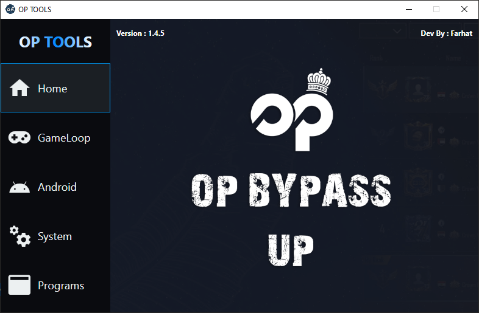

# OP TOOLS

**OP TOOLS** is a powerful all-in-one Windows utility built with **WPF**.  
It simplifies system maintenance, emulator support, and includes one-click installers for essential tools — all within the Windows environment.

---

## Features

### System Utilities
- Disable Windows Error Reporting
- Change MAC Address
- Clean browser & system cache:
  - Chrome, Edge, Firefox, Brave, Opera
- Reset:
  - Network
  - Firewall
  - Temporary files
- Clean `$Recycle.Bin`, `WIN386.SWP`, Office junk, and more
- Auto-edit the `hosts` file

---

### Android Tools (via ADB)
- Install APKs directly
- Push / Pull `Paks` folder (PUBG Mobile)
- Enable ADB access in GameLoop
- KeyMap fix for:
  - Global version (`com.tencent.ig`)
  - Korea version (`com.pubg.krmobile`)

---

### GameLoop Spoofing
- Fake device identity (Samsung Galaxy Tab S10 Ultra 5G)
- Modify FPS, rendering quality, and resolution via Registry

---

## Libraries & UI Framework

This project uses the following UI packages via NuGet:

| Library                | Version | Description                       |
|------------------------|---------|-----------------------------------|
| MaterialDesignThemes   | 4.3.0   | Core styling for Material Design |
| MaterialDesignColors   | 4.3.0   | Extended color palette           |

### Install via NuGet Console:

Open Visual Studio → Tools → NuGet Package Manager → **Package Manager Console**  
Run:

```powershell
Install-Package MaterialDesignThemes -Version 4.3.0
Install-Package MaterialDesignColors -Version 4.3.0
```

---

## Project Structure

- `MainWindow.xaml`: WPF UI components and layout
- `MainWindow.xaml.cs`: Main logic and features
  - Auto updater
  - System / Android tools
  - Registry tweaks
  - File downloader with progress handling

---

## Requirements

- Visual Studio 2019 or newer
- .NET Framework 4.7.2 or later
- Internet connection (for update check and downloads)

---

## Screenshots

### Main Interface


### GameLoop Tools Page


### Android Tools Page


### System Tools Page


### Programs Page


---

## Notes

- To unlock all features, create a file named `opfarhatfrsn.txt` in the same directory as the `.exe`  
  Add the following content:
  
  ```
  opfrsnfarhat
  ```

---

## ⚠️ Disclaimer

This tool is intended for **personal and educational purposes** only.  
The developer is **not responsible** for any misuse or damage caused.
